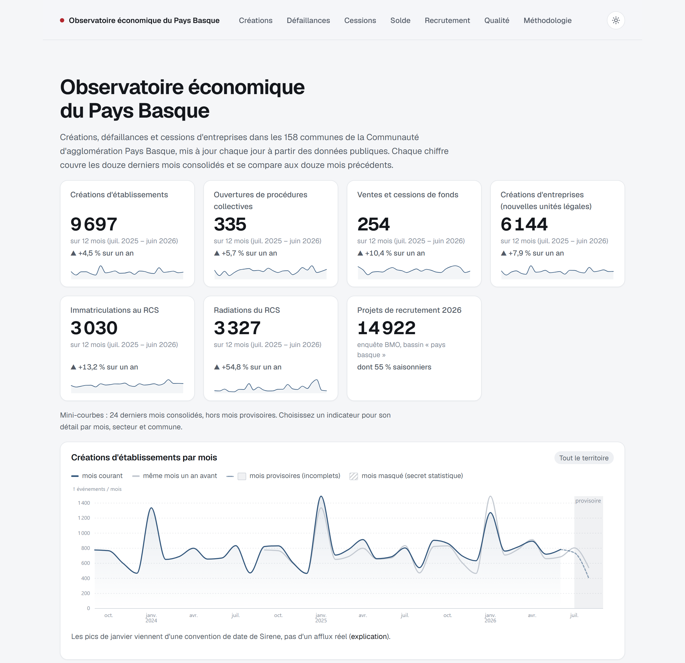
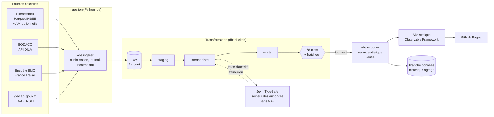
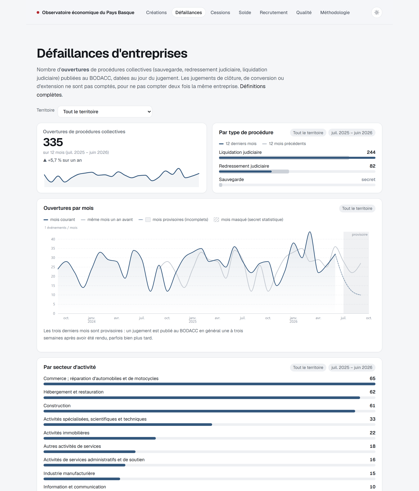
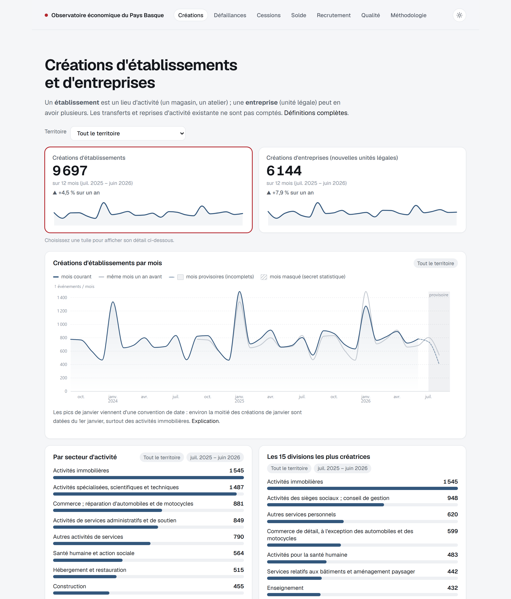

# Observatoire économique du Pays Basque

**Un tableau de bord public, mis à jour automatiquement, qui suit la vie économique des 158 communes
de la Communauté d'agglomération Pays Basque : créations d'entreprises, défaillances, cessions de
fonds et besoins de recrutement.**

Je construis des pipelines de données territoriales fiables, automatisés et documentés, de la source
officielle jusqu'à la décision. Ce projet en est la démonstration de bout en bout.



## En 2 minutes

| Ce que le projet démontre | Comment |
|---|---|
| **Ingestion multi-sources, rejouable** | 5 sources officielles (Sirene, BODACC, BMO, geo.api.gouv.fr, NAF) : API, fichiers Parquet lus à distance, classeurs Excel. Extraction incrémentale du BODACC, cache par version pour Sirene, `--forcer` pour tout reconstruire. |
| **Planification et historisation** | GitHub Actions quotidien. Le stock Sirene mensuel est détecté automatiquement. Chaque extraction est journalisée ; l'historique agrégé des runs est versionné. |
| **Qualité explicite** | 75 tests dbt (unicité, non-nullité, valeurs, relations, bornes, réconciliations, volumétrie, fraîcheur, absence de colonne nominative) : **un contrôle en échec bloque la publication**. Page qualité publique. |
| **Modélisation claire** | `raw` (Parquet) → `staging` → `intermediate` → `marts` en dbt-duckdb, puis export public. |
| **Protection des personnes** | Minimisation dès l'ingestion (aucun nom ni adresse extraits), secret statistique primaire et secondaire (seuil 5) avec vérification indépendante avant publication. |
| **IA utile et mesurée** | Les annonces sans code NAF sont classées par **Jev (TypeSafe)** à partir de leur texte d'activité, avec repli hiérarchique par confiance. Précision mesurée : 86 % ([évaluation](docs/evaluation_jev.md)). |
| **Visualisation lisible** | Site statique Observable Framework : séries comparées à N-1, carte des communes, tableaux, mobile. |
| **Documentation** | [Sources](docs/sources.md) · [Méthodologie](docs/methodologie.md) · [Décisions (ADR)](docs/decisions.md) · [Dictionnaire](docs/dictionnaire.md) |

Quelques résultats obtenus en construisant le projet, et documentés :

- 99,4 % des annonces BODACC rattachées à une commune, alors que le BODACC n'a pas de code INSEE : le
  code postal seul ne suffit pas (`64270` couvre des communes basques et béarnaises).
- 98,8 % des annonces avec SIREN jointes à Sirene.
- ~21 % des « nouveaux SIRET » sont des transferts ou des reprises, pas des créations : ils sont exclus.
- Le bassin d'emploi BMO « Pays Basque » ne couvre que 122 des 158 communes (96,2 % de la population) :
  le recouvrement est calculé et affiché.
- Les pics de créations en janvier sont une convention de date (la moitié des créations de janvier
  sont datées du 1er janvier), pas un afflux réel.

## Architecture



Chaque étape échoue bruyamment : si un test, la fraîcheur d'une source ou le contrôle du secret
statistique échoue, le workflow s'arrête et la version en ligne reste la précédente.

## Captures

| Défaillances | Créations |
|---|---|
|  |  |

## Relancer le projet (≈ 15 minutes)

Prérequis : [uv](https://docs.astral.sh/uv/), Node.js ≥ 20, un accès internet. Aucune clé n'est
obligatoire.

```bash
git clone https://github.com/Alex6460064/observatoire-economique-pays-basque.git
cd observatoire-economique-pays-basque
uv sync
uv run obs run                 # ingestion + dbt build + contrôles + export (~3 min au premier run)
cd site && npm ci && npm run dev   # tableau de bord sur http://127.0.0.1:3000
```

Commandes utiles :

```bash
uv run obs --perimetre bab_littoral run   # sous-périmètre de 10 communes (développement)
uv run obs ingerer --source bodacc        # une source seulement
uv run obs run --forcer                   # ignore les caches, relit tout depuis les sources
uv run pytest                             # 73 tests unitaires, sans réseau
uv run obs evaluer-jev --n 300            # évaluation de l'attribution sectorielle (clé TypeSafe)
uv run obs documenter                     # régénère docs/dictionnaire.md
```

Variables d'environnement : `OBS_DATA_DIR` (données, défaut `./data`), `OBS_PERIMETRE`,
`TYPESAFE_API_KEY` (optionnelle : sans elle, l'attribution sectorielle par IA est ignorée),
`INSEE_API_KEY` (optionnelle : sans elle, pas de complément API au stock Sirene mensuel).

> Windows : si les chemins longs sont désactivés, placez le dépôt et `OBS_DATA_DIR` dans un chemin
> court (DuckDB, Python et Node échouent au-delà de 260 caractères).

## Organisation du dépôt

```
config/                  périmètres et paramètres (aucune liste de communes « en dur »)
ingestion/               CLI `obs`, ingestion Sirene/BODACC/BMO, secret, export, Jev
packages/socle_territorial/  paquet réutilisable : geo, BMO, journal, HTTP, secret statistique
models/                  dbt : staging/, intermediate/, marts/
quality/                 tests de données singuliers (dbt)
macros/                  macros dbt (normalisation des communes, test générique)
site/                    tableau de bord Observable Framework
docs/                    sources, méthodologie, décisions, dictionnaire, évaluation Jev
.github/workflows/       CI (tests) et pipeline quotidien
```

## Choix techniques

Python 3.12 et uv · DuckDB (lecture distante des Parquet Sirene) · dbt-duckdb · Observable Framework
et Plot · GitHub Actions et GitHub Pages · TypeSafe Jev (optionnel). Chaque choix et ses
alternatives sont argumentés dans [docs/decisions.md](docs/decisions.md).

## Limites connues

- La commune d'une annonce BODACC est celle du siège pour une société.
- Sans `INSEE_API_KEY`, les créations du dernier mois dépendent du stock Sirene mensuel. Avec
  la clé, le mois courant est publié, incomplet et marqué provisoire.
- Le détail par commune et par mois est souvent masqué pour les petits indicateurs : il est
  proposé en cumul sur 12 mois.
- Chiffres non comparables aux créations d'entreprises publiées par l'INSEE (définitions
  différentes, voir la méthodologie).

## Données et licences

Données : Licence Ouverte / Etalab 2.0 (INSEE, DILA, geo.api.gouv.fr) et Licence Ouverte
(France Travail). Le site ne publie que des agrégats. Projet sans lien avec les producteurs des
données.
