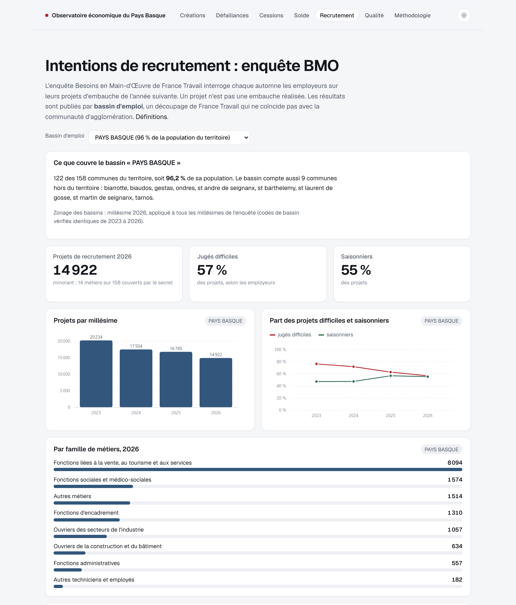
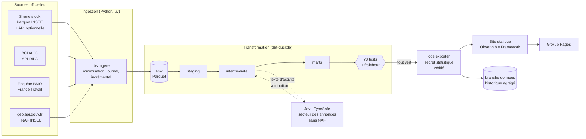

# Observatoire économique du Pays Basque

**Un tableau de bord public, mis à jour chaque jour, qui suit la vie économique des 158 communes de
la Communauté d'agglomération Pays Basque : créations d'entreprises, défaillances, cessions de fonds
de commerce et intentions d'embauche.**

**[Voir le tableau de bord](https://alex6460064.github.io/observatoire-economique-pays-basque/)** ·
[Méthodologie](docs/methodologie.md) · [Décisions techniques](docs/decisions.md)


## Le projet

Projet personnel mené seul, de la collecte des données jusqu'au site publié, par
**Alexandre Laffitte**, data analyst ([LinkedIn](https://www.linkedin.com/in/alexandrelaffitte)).

Il répond à deux objectifs :

- **Informer.** Donner une lecture simple et régulière de l'économie locale à partir de données
  publiques : combien d'entreprises se créent, combien entrent en difficulté, quels secteurs et
  quelles communes bougent, quels métiers les employeurs cherchent à recruter.
- **Montrer une méthode.** Construire un pipeline de données fiable, automatisé et documenté, comme
  en entreprise : sources officielles, tests de qualité, protection des personnes, visualisation.

## Ce que l'on peut y lire

| Page | Question | Source |
|---|---|---|
| **Créations** | Combien d'établissements et d'entreprises se créent, dans quels secteurs, quelles communes ? | Sirene (INSEE) |
| **Défaillances** | Combien de procédures collectives (sauvegarde, redressement, liquidation) sont ouvertes ? | BODACC |
| **Cessions** | Combien de fonds de commerce sont vendus ? | BODACC |
| **Solde indicatif** | Les créations compensent-elles les radiations ? | Sirene, BODACC |
| **Recrutement** | Combien de projets d'embauche, dans quels métiers, jugés difficiles ou saisonniers ? | Enquête BMO (France Travail) |
| **Qualité** | Les données sont-elles fraîches, les contrôles sont-ils au vert ? | Journal du pipeline |

Chaque indicateur porte sur les douze derniers mois consolidés et se compare aux douze mois
précédents, pour tout le territoire ou une commune. Les mois les plus récents sont marqués
**provisoires** : les enregistrements et publications arrivent en retard, ils ne sont pas lus comme
une tendance. Les chiffres suivent des définitions propres au projet et ne sont pas comparables à
ceux publiés par l'INSEE ([méthodologie](docs/methodologie.md)).

| Créations | Défaillances |
|---|---|
|  |  |

| Recrutement (enquête BMO) |
|---|
|  |

## Compétences mises en œuvre

| Compétence | Dans ce projet |
|---|---|
| **Collecte multi-sources** | 5 sources officielles (Sirene, BODACC, BMO, geo.api.gouv.fr, NAF) : API, fichiers Parquet lus à distance, classeurs Excel. Extraction incrémentale du BODACC, cache par version pour Sirene. |
| **Automatisation** | Pipeline quotidien sur GitHub Actions. Le nouveau stock Sirene mensuel est détecté tout seul. Chaque extraction est journalisée et l'historique agrégé des runs est versionné. |
| **Qualité des données** | 78 tests dbt (unicité, non-nullité, valeurs, relations, bornes, réconciliations, volumétrie, fraîcheur, absence de colonne nominative) et 78 tests unitaires Python. **Un contrôle en échec bloque la publication.** |
| **Modélisation** | Couches `raw` (Parquet) → `staging` → `intermediate` → `marts` en SQL avec dbt-duckdb. |
| **Protection des personnes** | Aucun nom ni adresse extrait des sources. Secret statistique (aucune case publiée entre 1 et 4, y compris par recalcul) vérifié indépendamment avant chaque publication. |
| **IA utile et mesurée** | Les annonces sans code d'activité sont classées par **Jev (TypeSafe)** à partir de leur texte. Seules les réponses assez sûres sont gardées : 86 % de justesse sur les 76 % d'annonces classées ([évaluation](docs/evaluation_jev.md)). |
| **Visualisation** | Site statique Observable Framework : comparaison à N-1, carte des communes, tableaux, lisible sur mobile. |
| **Documentation** | [Sources](docs/sources.md) · [Méthodologie](docs/methodologie.md) · [Décisions (ADR)](docs/decisions.md) · [Dictionnaire des données](docs/dictionnaire.md) |

Quelques difficultés rencontrées et résolues :

- Le BODACC n'a pas de code commune INSEE, et un code postal ne suffit pas (`64270` couvre des
  communes basques et béarnaises) : 99,4 % des annonces sont pourtant rattachées à une commune.
- ~21 % des « nouveaux établissements » Sirene sont des transferts ou des reprises, pas des
  créations : ils sont exclus.
- Le bassin d'emploi BMO « Pays Basque » ne couvre que 122 des 158 communes (96,2 % de la
  population) : le recouvrement est calculé et affiché.
- Les pics de créations en janvier sont une convention de date (la moitié des créations de janvier
  sont datées du 1er janvier), pas un afflux réel : c'est signalé sur les graphiques.

## Architecture



Chaque étape échoue bruyamment : si un test, la fraîcheur d'une source ou le contrôle du secret
statistique échoue, le workflow s'arrête et la version en ligne reste la précédente.

## Relancer le projet (≈ 15 minutes)

Prérequis : [uv](https://docs.astral.sh/uv/), Node.js ≥ 20, un accès internet. Aucune clé n'est
obligatoire.

```bash
git clone https://github.com/Alex6460064/observatoire-economique-pays-basque.git
cd observatoire-economique-pays-basque
uv sync
uv run obs run                 # ingestion + dbt build + contrôles + export (~3 min au premier run)
cd site && npm ci && npm run dev   # tableau de bord sur http://127.0.0.1:3000
```

Commandes utiles :

```bash
uv run obs --perimetre bab_littoral run   # sous-périmètre de 10 communes (développement)
uv run obs ingerer --source bodacc        # une source seulement
uv run obs run --forcer                   # ignore les caches, relit tout depuis les sources
uv run pytest                             # tests unitaires, sans réseau
uv run obs evaluer-jev --n 300            # évaluation de l'attribution sectorielle (clé TypeSafe)
uv run obs documenter                     # régénère docs/dictionnaire.md
```

Variables d'environnement : `OBS_DATA_DIR` (données, défaut `./data`), `OBS_PERIMETRE`,
`TYPESAFE_API_KEY` (optionnelle : sans elle, l'attribution sectorielle par IA est ignorée),
`INSEE_API_KEY` (optionnelle : sans elle, pas de complément API au stock Sirene mensuel).

> Windows : si les chemins longs sont désactivés, placez le dépôt et `OBS_DATA_DIR` dans un chemin
> court (DuckDB, Python et Node échouent au-delà de 260 caractères).

## Organisation du dépôt

```
config/                  périmètres et paramètres (aucune liste de communes « en dur »)
ingestion/               CLI `obs`, ingestion Sirene/BODACC/BMO, secret, export, Jev
packages/socle_territorial/  paquet réutilisable : geo, BMO, journal, HTTP, secret statistique
models/                  dbt : staging/, intermediate/, marts/
quality/                 tests de données singuliers (dbt)
macros/                  macros dbt (normalisation des communes, test générique)
site/                    tableau de bord Observable Framework
docs/                    sources, méthodologie, décisions, dictionnaire, évaluation Jev
.github/workflows/       CI (tests) et pipeline quotidien
```

## Choix techniques

Python 3.12 et uv · DuckDB (lecture distante des Parquet Sirene) · dbt-duckdb · Observable Framework
et Plot · GitHub Actions et GitHub Pages · TypeSafe Jev (optionnel). Chaque choix et ses
alternatives sont argumentés dans [docs/decisions.md](docs/decisions.md).

## Limites connues

- La commune d'une annonce BODACC est celle du siège pour une société.
- Sans `INSEE_API_KEY`, les créations du dernier mois dépendent du stock Sirene mensuel. Avec
  la clé, le mois courant est publié, incomplet et marqué provisoire.
- Le détail par commune et par mois est souvent masqué pour les petits indicateurs : il est
  proposé en cumul sur 12 mois.
- Les projets de recrutement BMO sont des intentions déclarées par les employeurs, pas des
  embauches réalisées.
- Chiffres non comparables aux créations d'entreprises publiées par l'INSEE (définitions
  différentes, voir la méthodologie).

## Données et licences

Données : Licence Ouverte / Etalab 2.0 (INSEE, DILA, geo.api.gouv.fr) et Licence Ouverte
(France Travail). Le site ne publie que des agrégats. Projet sans lien avec les producteurs des
données.

## Contact

Alexandre Laffitte · [LinkedIn](https://www.linkedin.com/in/alexandrelaffitte) ·
[GitHub](https://github.com/Alex6460064)
